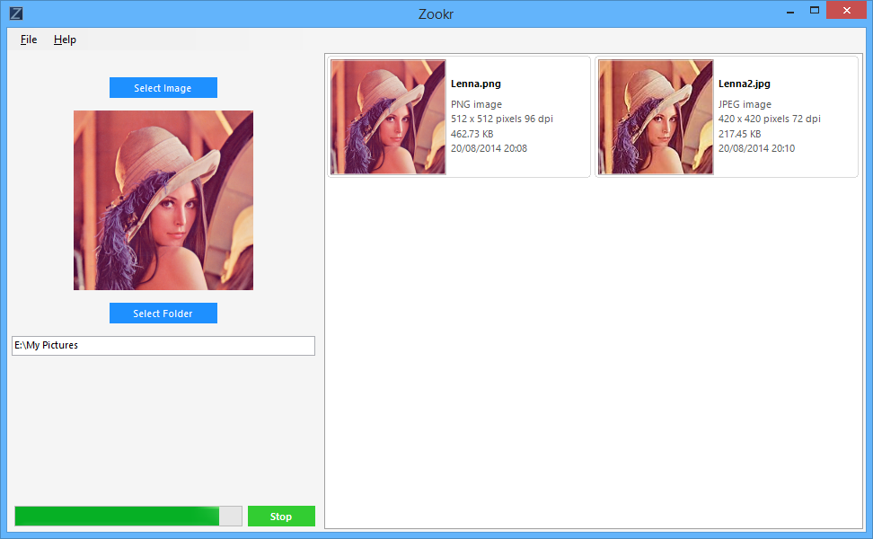

Zookr
=====
Zookr is an application that searches for similar images, like TinEye and Google's Search by Image, but locally. 

Makes use of [ImageListView](http://www.codeproject.com/Articles/43265/ImageListView) to render the thumbnails.

###### Known Issues
* It doesn't always find a match that has a different aspect ratio than the source image. This is because the difference in the way artifacting occurs when the images are shrunk down is enough to put the target image out of a reasonable Hamming range.